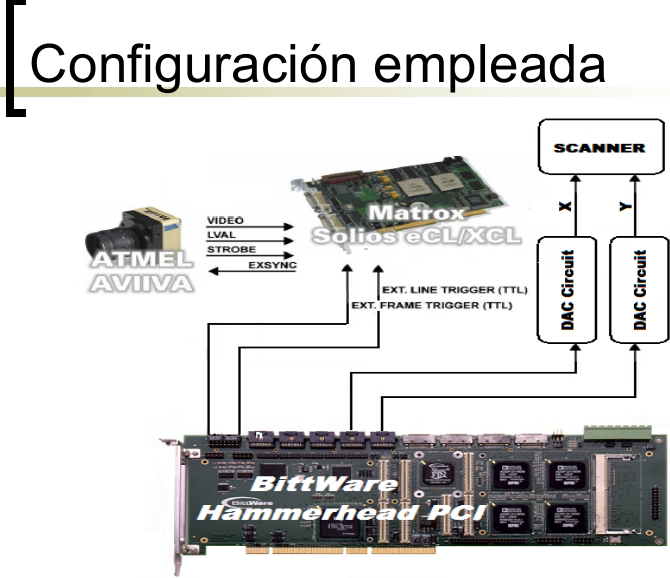

## Laboratorio de Optica Biomedica, 2007

1. **Motivacion**: FDOCT en tiempo real Hardware disponible. Especificaciones. Interfaz de usuario

2. **Tarjeta DSP** con 4 procesadores

3. Como paralelizar el procesado de imagen? 1 procesador para cada cuarto de imagen(dspFDOCT) 4 procesadores para cada linea(parallelFFT)

4. **Conclusiones**. Resultados de ambos métodos

### Introduccion a la FDOCT

Fourier Domain Optical Coherence Tomography: método emergente de imagen biomédica de alta resolucion.

Para obtener la imagen de la muestra de tejido debemos hacer un procesado digital en tiempo real: algorithmo FFT. Los procesadores DSP están disenados para hacer la FFT eficientemente.

### Hardware Disponible

Camara lineas de 1024 pixeles de 16 bits,  muy rapida: hasta 20 Klineas/s

Frame-Grabber: adquisición de imagenes por el PC

Scanner: obtencion de imágenes 2D a partir de lineas; gira la muestra al mismo ritmo que la frecuencia de adquisicion

### Especificaciones del PFC

Tarjeta DSP para procesar la DFT de una linea y generar  los disparadores para el sincronismo con el scanner y la cámara  line-scan: line-trigger(1D), frame-trigger(2D)

Tarjeta ADI con cuatro procesadores SHARC@ 80 MHz con 4Mbit. Bus PCI hacia el PC anfitrion

Requisitos de 2° nivel: frecuencia de linea variable =10 KHz sin overflow (single precision IEEE-754)

- frecuencia maxima de funcionamiento del scanner mecánico
- frecuencia aceptable para obtener imágenes en tiempo real

### Interfaz LABView

### Procesador SHARC SIMD

 

### Function fast-FFT del SHARC

mag( real_FFT) en las librerias C-SHARC

- 2 lineas a la vez (doble nucleo) en 800 us
- 800 us÷2 lineas=400 us por linea y DSP --> throughput=2500 FFTs/sec y por procesador

### Parametros de tiempo real

Conversion del formato de datos

1 línea=1024 píxeles de 16 bits (2KB)

2 líneas=1024 palabras de 32 bits (4KB)

N procesadores esclavos

​		2 Lines_Period = 800 us(1250 Hz)

​		Throughput =N x 2500 FFTs/sec

​		Data Rate =N x 4KB ÷ 2 Lines_Period

​		Latencia = 2 Lines_Period (N x 2 líneas)

N = 2 esclavos trabajando al mismo tiempo (2 y 4):

​		Throughput = 5000

​		Latencia= 800 us (4 lineas)

​		Data Rate = 10 MB/s

### Conclusiones

- no se cumple requisito de 10,000 FFTs/sec!!!
- conversion de datos pesada en dspFDOCT
- tarjetas DSP más baratas que PC, FPGA o ASIC; mejor relacion W/MFLOPs
- entrenamiento para placas recientes (escalable)